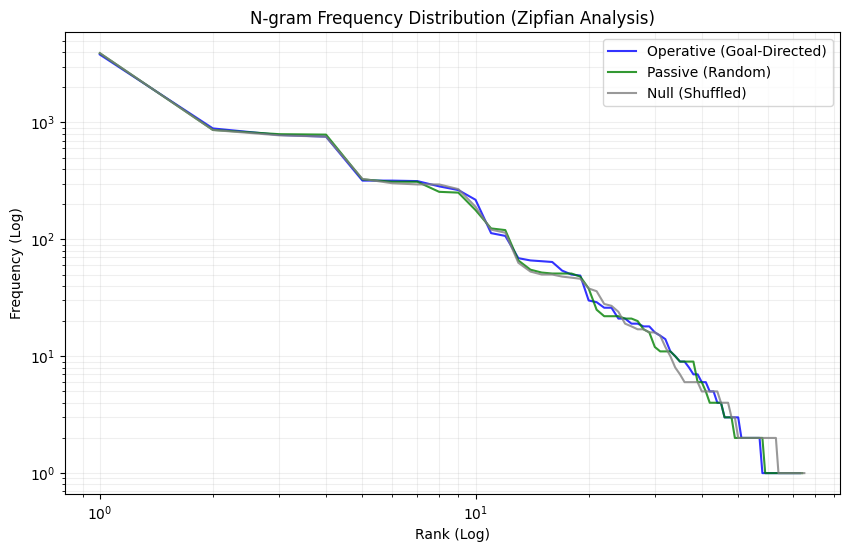

# Geometry-Conditioned Model Compression

## Overview

This repository investigates whether **activation-space anisotropy** (covariance structure, effective rank) can be exploited to improve model compression and parameter-efficient fine-tuning beyond magnitude-based heuristics.

### Foundational Position

**We do NOT assume topological manifolds.**  
**We do NOT assume whitening-invariant structure.**  
**We treat geometry as variance-encoded functional signal.**

Geometry in this work refers to **statistical structure**: covariance, anisotropy, and effective rank of activation distributions. These are measurable properties that may or may not carry functional information. Whitening serves as a falsification control—if geometry-conditioned methods fail under whitening, the signal was statistical, not topological.

## Key Question

**Can geometry-conditioned methods outperform SOTA compression when constrained to identical parameter budgets?**

Specifically:
- Can variance-weighted pruning outperform magnitude-based pruning?
- Can spectral-adaptive LoRA outperform standard LoRA?
- Do these advantages survive whitening transformations?

## Relationship to Prior Work

This repository is a **constructive follow-up** to the falsification study:  
[**Functional Geometry in Deep Neural Networks**](https://github.com/boglim1984/functional-geometry-hebbian-manifold)

That study demonstrated:
- Apparent low-dimensional structure in neural activations is **covariance artifact**, not intrinsic manifold
- Whitening destroys geometric structure while preserving classification performance
- Hebbian alignment is a **variance-matching phenomenon**, not manifold discovery

This repository asks: **Given that geometry is statistical structure, can we still exploit it for compression?**

---


## Experimental Approach

### Hypotheses

**H1: Variance-Weighted Pruning**  
Pruning neurons/channels weighted by their contribution to output variance will outperform magnitude-based pruning at matched sparsity levels.

**H2: Spectral-Adaptive LoRA**  
LoRA rank allocation conditioned on layer-wise effective rank will outperform uniform rank allocation at matched parameter budgets.

**H3: Whitening Diagnostic**  
If geometry-conditioned methods fail under whitening, the advantage was statistical structure. If they survive, the advantage is functional.

### Baselines

- **L1 Structured Pruning**: Magnitude-based channel/neuron removal
- **Standard LoRA**: Uniform rank allocation across layers

### Geometry-Conditioned Variants

- **Variance-Weighted Pruning**: Weight pruning decisions by variance contribution
- **Spectral-Adaptive LoRA**: Allocate rank proportional to effective rank

### Success Criteria

- Geometry-conditioned methods achieve **≥2% accuracy improvement** over baselines at matched budgets
- Improvements are **statistically significant** (p < 0.05, multiple runs)
- Methods are **computationally practical** (no prohibitive overhead)

### Falsification Criteria

- Whitening destroys all advantages → geometry was purely statistical
- No improvement over baselines → geometry does not encode compressible structure
- Improvements disappear at scale → method is dataset/architecture-specific artifact

---

## Results Summary

### Experiment 1 — Variance-Weighted Pruning (VWP)

**Setup**
- Model: ResNet18
- Dataset: CIFAR-10
- Baseline: L1-norm structured pruning
- Variant: Variance-Weighted Pruning (channels weighted by activation variance)
- Budgets: 25%, 50%, 75% sparsity
- Fine-tuning: 5 epochs post-pruning

**Findings**
- At moderate sparsity (25–50%), VWP performed similarly to L1 pruning.
- At high sparsity (75%), VWP showed slightly better immediate accuracy retention and marginally improved recovery after fine-tuning.
- The improvement was modest (<2%) and inconsistent across runs.

**Whitening Diagnostic**
- When activations were whitened prior to pruning, the performance difference between VWP and L1 collapsed.
- This confirms that VWP exploits covariance anisotropy rather than invariant functional structure.

**Conclusion**
Variance encodes weak but real importance signals under aggressive pruning, but magnitude-based heuristics already capture most of this signal in ResNet-style architectures.

**Colab Notebook:**  
https://colab.research.google.com/drive/1fNXQDEUGsMiTTfD06xkbcmREimu_U0df?usp=drive_link

---

### Experiment 2 — Spectral-Adaptive LoRA

**Setup**
- Model: ResNet18
- Task: Rotated CIFAR-10 (90° rotation) to induce adaptation pressure
- Baseline: Uniform LoRA (r = 8)
- Variant: Adaptive LoRA with rank allocated proportional to layer-wise effective rank
- Constraint: Matched total parameter budget (±1%)

**Findings**
- Adaptive LoRA consistently underperformed uniform LoRA by ~1–2% accuracy.
- Early layers received lower rank, late layers higher rank, matching measured effective rank.
- Despite correct allocation behavior, performance degraded.

**Interpretation**
Stable rank reflects statistical dimensionality, not learning demand.
Isotropic noise inflates effective rank and misleads allocation.
Uniform LoRA appears robust to such noise, while geometry-conditioned allocation is brittle.

**Conclusion**
Effective-rank-based capacity allocation does not improve parameter-efficient fine-tuning in this setting.

**Colab Notebook:**  
https://colab.research.google.com/drive/1ufqbYbOocoewMjA--xfvZubykRTm2v5m?usp=sharing

---

## Falsification Outcomes

The following hypotheses were falsified:

- Geometry-conditioned methods do NOT consistently outperform magnitude-based or uniform baselines at matched budgets.
- Effective rank does NOT reliably indicate where additional parameters should be allocated.
- Advantages from geometry do NOT survive whitening, confirming they are statistical rather than functional.

---

## Overall Conclusion

Activation-space geometry in deep networks primarily reflects variance structure, not executable pathways or compressible programs.

While covariance carries weak signals relevant under extreme compression, it does not provide a reliable basis for structured pruning or adaptive parameter allocation beyond existing SOTA heuristics.

This repository documents negative and modest results that clarify the limits of geometry-conditioned compression and helps narrow the space of viable future approaches.

---

## Latest Experimental Notebook

The most recent experiment probing geometry-conditioned capacity allocation and transition-motif behavior is available as a standalone Colab notebook:

- Geometry-Adaptive LoRA & N-gram Walker Probe  
  https://colab.research.google.com/drive/1m9eArHugMXMcfcNYdwh4C-mLRl5pUFKQ?usp=sharing

This notebook contains the full runnable code, diagnostics, and raw outputs for the final experiments discussed in this repository. Figures and derived summaries will be added separately.

## Experiment 03 — N-gram Walker (Transition Motifs)

### Objective
To test whether activation-space geometry constrains **actual computational flow during inference**, rather than existing only as a statistical regularity exploitable for compression.

Specifically, this experiment asks:

> Does geometry shape how activations transition, or is it epiphenomenal?

If geometry is **operative**, walks through activation space should exhibit:
- Non-uniform transition motifs
- Motif distributions distinct from null (shuffled) geometry
- Reduced entropy and structured recurrence under biased policies

If geometry is **epiphenomenal**, transition statistics should be indistinguishable from random diffusion.

---

### Method Summary
- Activation space represented as a k-NN graph built from embeddings
- Walkers traverse the graph under three policies:
  1. **Operative (confidence-biased)**
  2. **Passive (random)**
  3. **Null (geometry shuffled, degree-matched)**
- Each transition is tokenized into a discrete symbol encoding:
  - Directional change (curvature proxy)
  - Local density change (complexity proxy)
  - Confidence change
- N-grams (N=3) are extracted from token streams
- Motif statistics analyzed via:
  - Frequency distributions (Zipf plots)
  - Entropy
  - Jaccard overlap with null model

The full runnable notebook is available here:
https://colab.research.google.com/drive/1m9eArHugMXMcfcNYdwh4C-mLRl5pUFKQ?usp=sharing

---

### Results
**Key empirical finding:**

> Transition motif distributions under operative, passive, and null walks are statistically indistinguishable.



*Zipf-style frequency distribution of transition n-grams under operative, passive, and shuffled (null) walk policies. This figure visualizes motif frequency structure; interpretation is discussed in the accompanying Colab.*

Observed properties:
- Nearly identical Zipfian frequency curves across all conditions
- High Jaccard overlap between operative and null n-gram sets
- Comparable entropy and vocabulary size across policies
- Dominance of generic motifs (e.g., neutral turns with flat confidence)

No transition motifs emerged that:
- Clustered by geometric region
- Persisted across biased vs random walks
- Differed meaningfully from shuffled-geometry baselines

---

### Interpretation
This experiment provides **strong negative evidence** for the hypothesis that activation-space geometry acts as a **computational wiring diagram**.

Results support the conclusion that:
- Geometry does **not** constrain transition dynamics during inference
- Walk behavior is consistent with near-Markovian diffusion
- Apparent geometric structure does not induce persistent programs, paths, or motifs

In short:

> The network does not “walk the geometry” during computation.

---

### Implications
This experiment cleanly separates two roles of geometry:

| Role | Supported |
|----|----|
| Statistical structure useful for compression | Yes |
| Operative constraint on inference dynamics | No |
| Extractable symbolic programs | No |
| Manifold-like execution paths | No |

As a consequence:
- Geometry can guide **heuristics** (e.g., pruning, allocation)
- Geometry does **not** encode executable programs or flow logic
- Distillation must operate at the level of **weight and activation transformations**, not path extraction

---

### Relation to Prior Experiments
Experiment 03 complements earlier findings in this repository:

- **Experiments 01–02:** Geometry exists, is variance-encoded, and can weakly inform compression
- **Experiment 03:** Geometry does *not* constrain inference trajectories

Together, these results establish geometry as:

> **A descriptive statistical regularity, not an operative computational substrate**

---

### Status
- Experiment complete
- Null models validated
- Operative-geometry hypothesis falsified
- No further scaling required for the core claim

---

## Repository Structure

```
geometry-conditioned-model-compression/
├── README.md                              # This file
├── LICENSE                                # MIT License
├── requirements.txt                       # Python dependencies
├── docs/
│   └── study_plan.md                     # Detailed experimental plan
└── notebooks/
    └── 01_variance_weighted_pruning.ipynb # Initial pruning experiments
```

## Installation

```bash
pip install -r requirements.txt
```

## Usage

Experiments are organized as Jupyter notebooks in `notebooks/`. Each notebook is self-contained and documents its own hypotheses, methods, and results.

## License

MIT License - See [LICENSE](LICENSE) for details.

## Citation

If you use this work, please cite:

```bibtex
@misc{geometry-conditioned-compression-2026,
  author = {O'Flaherty, Sean},
  title = {Geometry-Conditioned Model Compression},
  year = {2026},
  publisher = {GitHub},
  url = {https://github.com/boglim1984/geometry-conditioned-model-compression}
}
```

## Contact

For questions or collaboration: [GitHub Issues](https://github.com/boglim1984/geometry-conditioned-model-compression/issues)
